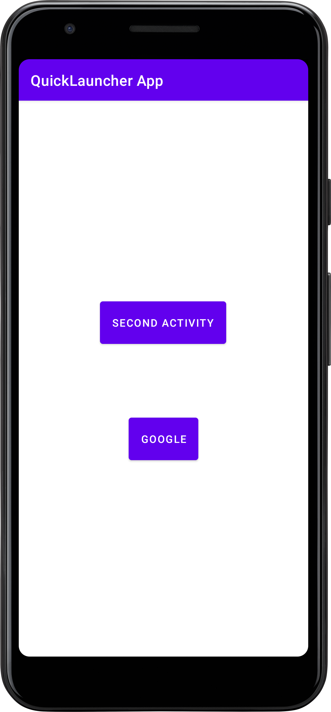

# Quick Launcher App

This Android project demonstrates a simple launcher app with two activities.
The main activity (`MainActivity.java`) allows you to launch a second activity (`SecondActivity.java`)
within the app and also open a web page outside the app.

## MainActivity.java

```java
package com.example.quicklauncherapp;

import androidx.appcompat.app.AppCompatActivity;
import android.content.Intent;
import android.net.Uri;
import android.os.Bundle;
import android.view.View;
import android.widget.Button;

public class MainActivity extends AppCompatActivity {

    @Override
    protected void onCreate(Bundle savedInstanceState) {
        super.onCreate(savedInstanceState);
        setContentView(R.layout.activity_main);

        // Button to launch the SecondActivity within the app
        Button b_secondActivity = findViewById(R.id.b_secondActivity);
        b_secondActivity.setOnClickListener(new View.OnClickListener() {
            @Override
            public void onClick(View view) {
                // Creating an Intent to start the SecondActivity
                Intent startIntent = new Intent(getApplicationContext(), SecondActivity.class);
                startIntent.putExtra("Something Bro!", "Hello World! You are in the Second Activity.");
                startActivity(startIntent);
            }
        });

        // Button to open Google in a web browser
        Button b_google = findViewById(R.id.b_google);
        b_google.setOnClickListener(new View.OnClickListener() {
            @Override
            public void onClick(View view) {
                // Creating an Intent to open a web page
                String google = "https://www.google.com";
                Uri web_address = Uri.parse(google);
                Intent browser_Intent = new Intent(Intent.ACTION_VIEW, web_address);
                startActivity(browser_Intent);
            }
        });
    }
}
```

## SecondActivity.java

```java
package com.example.quicklauncherapp;

import androidx.appcompat.app.AppCompatActivity;
import android.os.Bundle;
import android.widget.TextView;

public class SecondActivity extends AppCompatActivity {

    @Override
    protected void onCreate(Bundle savedInstanceState) {
        super.onCreate(savedInstanceState);
        setContentView(R.layout.activity_second);

        // Checking if the Intent has extra data
        if (getIntent().hasExtra("Something Bro!")) {
            // Displaying the passed data in the SecondActivity
            TextView tv_secondActivity = findViewById(R.id.tv_secondActivity);
            String text = getIntent().getExtras().getString("Something Bro!");
            tv_secondActivity.setText(text);
        }
    }
}
```

This simple Android app showcases the basic usage of Intents to launch activities within the app and open external web pages. The communication between activities is demonstrated through passing data using `putExtra` and retrieving it using `getExtras().getString()`.

## Screenshots




